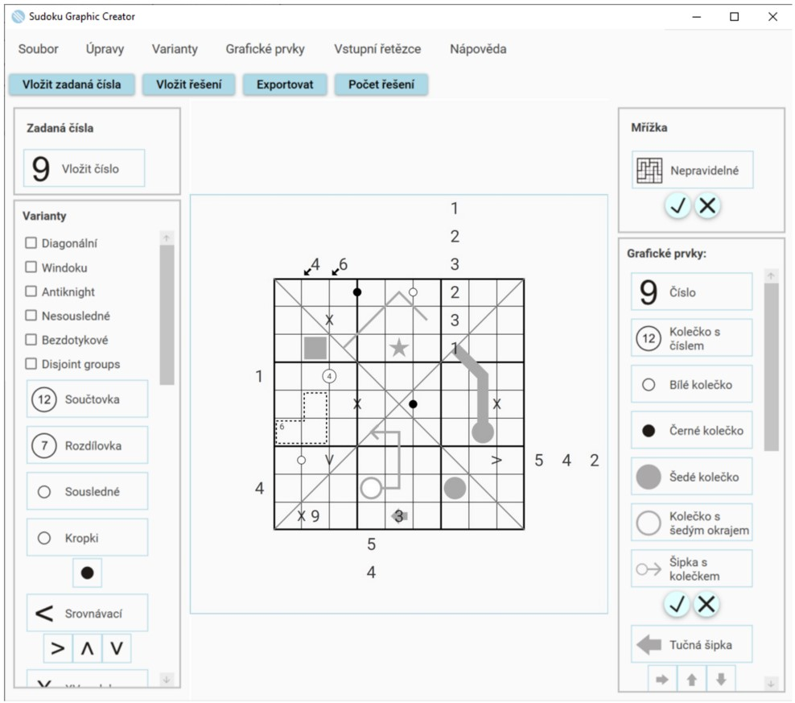
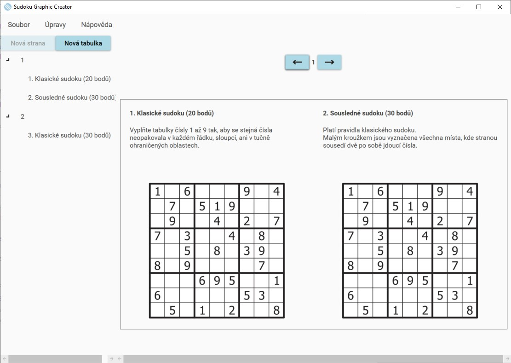
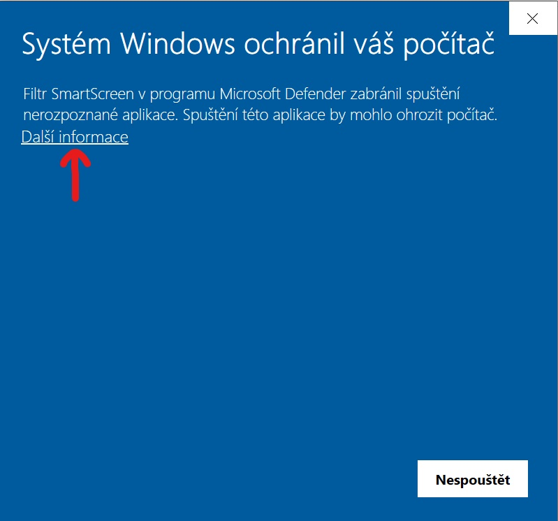
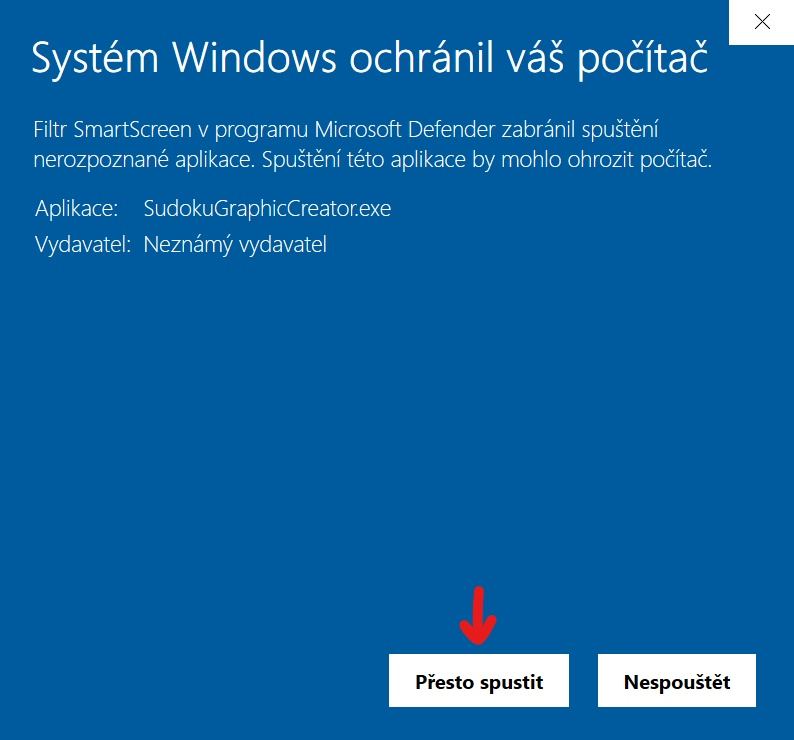

# Sudoku Graphic Creator
Sudoku Graphic Creator is a desktop application for the graphical creation of sudoku grids and competition booklets. The goal of the application is to speed up the preparation of sudoku tournaments and prevent the occurrence of incorrect sudoku in these tournaments.

You can download this application from [here](https://github.com/KlimesovaLucie/SudokuGraphicCreator/releases/download/1.0.0/SGC.zip).

## Supported features
### Creating sudoku
  - supported grid size are 6x6, 9x9,
  - compute all possible solutions for supported variants,
  - export computed solution of created sudoku,
  - export image into PNG and SVG format.
### Creating booklets
 - application can create default rules version based on type of inserted variant,
 - create solution from loaded SVG image of sudoku (only for supported variants),
 - besides booklets, solution file can also be exported.
### Supported variants
 - Classic
 - Antiknight
 - Nonconsecutive
 - Untouchable
 - Disjoint Groups
 - Sum
 - Diffence
 - Consecutive
 - Greater Than
 - XV Sudoku
 - Kropki
 - Odd
 - Even
 - Star product
 - Search nine
 - Diagonal
 - Palindromes
 - Sequences
 - Arrows
 - Windoku
 - Extraregions
 - Killer
 - Irregular
 - Skyscrapers
 - Outside
 - Next To Nine
 - Little Killer
 - Thermometers

## Instalation
Supported platforms: *Windows 32bit/64bit*.

After you download the application you have to extract the zip file. At first start of application, you have to make exception for *Windows Defender*. `Another informations` -> `Run anyway`

